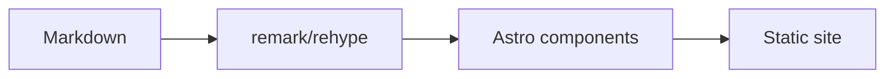

Write plain Markdown; the theme handles the rest at build time. This post exercises everything it renders.

## Typography

Regular paragraphs with **bold**, *italic*, ~~strikethrough~~, an [inline link](https://astro.build/), `inline code`, and keyboard keys like <kbd>Ctrl</kbd> + <kbd>K</kbd> for search.

> A plain blockquote: for quoted words, not for callouts.

A footnote reference[^1] sits at the end of a sentence.

[^1]: And its note collects at the bottom of the page.

## Lists

- Unordered items
- Nest freely
  - Like this
- Task lists work too:
  - [x] Write the post
  - [ ] Publish it

1. Ordered items
2. Count themselves

## Alerts

GitHub-style callouts, five kinds:

> [!NOTE]
> Useful information that readers should know, even when skimming.

> [!TIP]
> A helpful suggestion for doing something better.

> [!IMPORTANT]
> Key information required to achieve a goal.

> [!WARNING]
> Urgent info that needs immediate attention to avoid problems.

> [!CAUTION]
> Advises about risks or negative outcomes.

## Table

| Syntax | Renders as |
| --- | --- |
| `**bold**` | **bold** |
| `` `code` `` | `code` |
| `~~strike~~` | ~~strike~~ |

## Code

Fenced blocks go through Expressive Code — titles, line highlights, and copy buttons included:

```ts title="src/example.ts" {3}
type ColorMode = 'light' | 'dark' | 'auto';

export function setMode(mode: ColorMode) {
  document.documentElement.classList.toggle('dark', mode === 'dark');
}
```

## Tabs

Group alternatives with directives — four colons outside, three inside:

::::tabs
:::tab{title="pnpm"}

```sh
pnpm install
```

:::

:::tab{title="npm"}

```sh
npm install
```

:::
::::

## Images and gallery

A single image stays a figure with a caption. Consecutive images become a gallery with a lightbox:


## Math

Inline math like $E = mc^2$, and display math:

$$
\int_{-\infty}^{\infty} e^{-x^2} \, dx = \sqrt{\pi}
$$

## Diagrams



## Details

<details>
<summary>Collapsed by default</summary>

Anything Markdown can render fits inside, including `code` and lists.

</details>

---

A horizontal rule closes the show.
