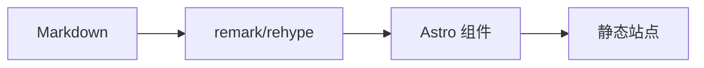

按普通 Markdown 书写,其余交给构建期处理。本文演示主题渲染的全部能力。

## 排版

普通段落里可以有**加粗**、*斜体*、~~删除线~~、[行内链接](https://astro.build/)、`行内代码`,以及键盘按键 <kbd>Ctrl</kbd> + <kbd>K</kbd>(打开搜索)。

> 普通引用块:用于引述,而不是提示。

句末可以放一个脚注[^1]。

[^1]: 脚注内容会收集到页面底部。

## 列表

- 无序列表
- 可自由嵌套
  - 像这样
- 任务列表也支持:
  - [x] 写完这篇文章
  - [ ] 发布它

1. 有序列表
2. 自动计数

## 提示块

GitHub 风格的提示块,共五种:

> [!NOTE]
> 即使快速浏览,读者也应该知道的有用信息。

> [!TIP]
> 把事情做得更好的小建议。

> [!IMPORTANT]
> 达成目标所必需的关键信息。

> [!WARNING]
> 需要立即注意以避免问题的紧急信息。

> [!CAUTION]
> 提醒某些操作的风险或负面后果。

## 表格

| 语法 | 渲染为 |
| --- | --- |
| `**加粗**` | **加粗** |
| `` `代码` `` | `代码` |
| `~~删除线~~` | ~~删除线~~ |

## 代码

围栏代码块由 Expressive Code 渲染——支持标题、行高亮与复制按钮:

```ts title="src/example.ts" {3}
type ColorMode = 'light' | 'dark' | 'auto';

export function setMode(mode: ColorMode) {
  document.documentElement.classList.toggle('dark', mode === 'dark');
}
```

## Tabs

用指令语法组织多个备选——外层四个冒号,内层三个:

::::tabs
:::tab{title="pnpm"}

```sh
pnpm install
```

:::

:::tab{title="npm"}

```sh
npm install
```

:::
::::

## 图片与图库

单张图片保持为带说明的插图;连续多张图片自动组成带灯箱的图库:


## 数学公式

行内公式如 $E = mc^2$,以及块级公式:

$$
\int_{-\infty}^{\infty} e^{-x^2} \, dx = \sqrt{\pi}
$$

## 图表



## 折叠详情

<details>
<summary>默认折叠</summary>

Markdown 能渲染的内容都可以放进来,包括 `代码` 和列表。

</details>

---

一条分隔线结束演示。
